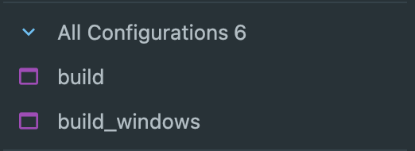
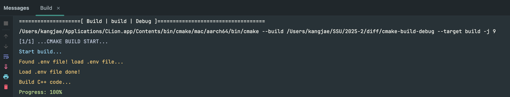

# diff

## 개요
이 프로젝트는 숭실대학교 2025년 2학기 미디어경영학과 프로그래밍2 수업의 기말고사 프로젝트입니다. <br />
C++, WASM을 사용하여 고속으로 대용량 텍스트 파일의 다른 부분(diff)를 찾아내어 보기좋게 제공합니다.

## (팀명)
- 최강재, 팀장
- 류현서
- 임소연

## 환경설정
### emsdk 설치
**표준 설치 방법**
1. `emsdk` repository 복제
```shell
$ git clone https://github.com/emscripten-core/emsdk.git
$ cd emsdk
```

2. `emsdk` 최신 버전 설치
```shell
$ ./emsdk install latest
```

3. `emsdk` 활성화
```shell
$ ./emsdk activate latest
```

4. 현재 Shell에서 `emsdk` 환경변수 설정
```shell
$ source ./emsdk_env.sh # for Linux, macOS
$ emsdk_env.bat # for Windows
```

**macOS(homebrew)**
```shell
$ brew install emscripten
```

### Bun.js(Web Runtime) 설치
**Windows(PowerShell)**
```shell
$ powershell -c "irm bun.sh/install.ps1 | iex"
```

**macOS**
```shell
$ curl -fsSL https://bun.sh/install | bash
```

### (선택) CMake 설치
**Windows(PowerShell)**
```shell
$ winget install Kitware.CMake
```

**macOS(homebrew)**
```shell
$ brew install cmake
```

## 빌드 및 실행
### .env 작성
프로젝트 환경 변수를 `.env`에서 관리하고 있습니다. <br />
`.env`내 환경 변수를 작성해주세요.

```shell
EXPORTED_FUNCTIONS=["_test_console"] # 공개할 함수를 작성
EXPORTED_RUNTIME_METHODS=["ccall"] # Runtime에서 사용할 Method를 작성
```

### C++ 코드 빌드
**Windows(PowerShell)**
```shell
# 단독 실행
$ .\build.ps1

# 추가 환경 변수와 함께 실행
$ $env:EXPORTED_FUNCTIONS='["_test_console","_another_func"]'
$ $env:EXPORTED_RUNTIME_METHODS='["ccall","cwrap"]'
$ .\build.ps1
```

**Linux / macOS**
```shell
$ ./build.sh
$ sh build.sh
```

**CLion IDE** <br />
보통 CLion과 같은 IDE(통합개발환경)를 설치하여 사용하면 `CMake`와 같은 빌드 도구들이 같이 설치되고 활용됩니다.
1. Project 열기
2. `cmake-build-debug`폴더가 생겼는지 확인, 없다면 로딩 대기
3. 우측 상단 `Build`(망치 아이콘) 클릭
   1. 
   2. 
4. `Build` 성공 확인. `public/` 하위에 `main.js`, `main.wasm`파일이 생겨야 합니다.


### Web 환경설정 및 코드 빌드
1. `web/` 으로 이동해주세요.
2. 의존성 패키지를 설치해주세요.
```shell
$ bun install
```
3. 빌드
```shell
$ bun run build # dist/ 이름으로 빌드 결과가 생성됩니다. 
```

### 실행
`8080`Port으로 Serving됩니다. <br />
브라우저에서 `localhost:8080`으로 접속해주세요.

```shell
$ python -m http.server -d web/dist/ 8080
# Serving HTTP on :: port 8080 (http://[::]:8080/) ...
```

## 역할 분담
- 최강재(팀장)
  - diff 서브 로직 개발
  - C++ ↔ JS간 통신 로직 구성 및 개발, JS 로직 개발
  - 버전 관리
  - 인프라 관리
  - CI/CD 설계 및 개발
  - Web UI/UX 개발
- 류현서(팀원)
  - diff 메인 로직 개발
  - diff 프로젝트 의존성 관리
  - diff 프로젝트 테스트 개발
- 임소연(팀원)
  - diff 메인 로직 개발
  - 발표자료 구성 및 작성
  - C++ ↔ JS간 Report 구성 및 테스트

## 개발 중 어려웠던 점과 해결 방법
TBD.

## 성능 최적화 시도
TBD.

## P.S.
### [Git-flow](https://techblog.woowahan.com/2553/) 전략으로 Branch를 관리합니다.
**Branches**
- `master`: Static site를 배포하기 위한 브랜치
- `develop`: 개발된 내용들의 집합
- `hotfix`: 배포된 내용을 급하게 수정할 때 사용하기 위한 브랜치, `master`에서 분기해주세요.
- `feature/`: 가장 작은 단위 개발 내용, `develop`에서 분기해주세요.
- `refactor/`: 가장 작은 단위의 개선 내용, `develop`에서 분기해주세요.
- `chore/`: Build와 관련된 수정 및 개선 내용, `develop`에서 분기해주세요.
- `docs/`: 문서 수정 및 추가 내용, `develop`에서 분기해주세요.

**Commits**
- `feature:`: 가장 작은 단위 개발 내용
- `refactor:`: 가장 작은 단위의 개선 내용
- `chore:`: Build와 관련된 수정 및 개선 내용
- `hotfix:`: `hotfix` 브랜치에서의 작업 내용
- `docs:`: 문서 수정 및 추가 내용